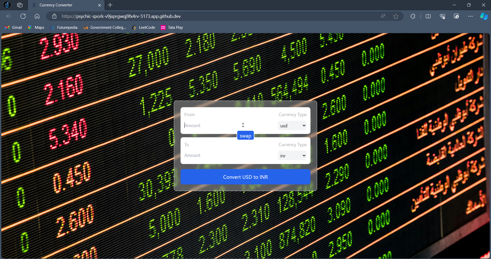

# Currency Converter

Currency Converter is a simple web application built using React that allows users to convert between different currencies.

## Features

- Convert from one currency to another with real-time exchange rates
- Select the currencies you want to convert between
- Swap between the selected currencies with one click
- Convert currencies with a user-friendly interface

## To run 

- Naviagate to folder and 
``` Javascript
npm run dev
```

## Reference

https://github.com/hiteshchoudhary

## Project Preview

